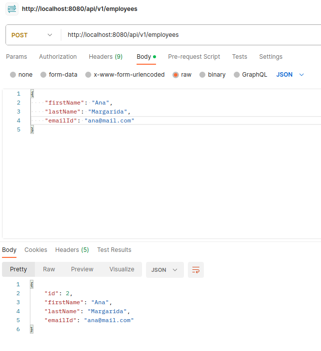
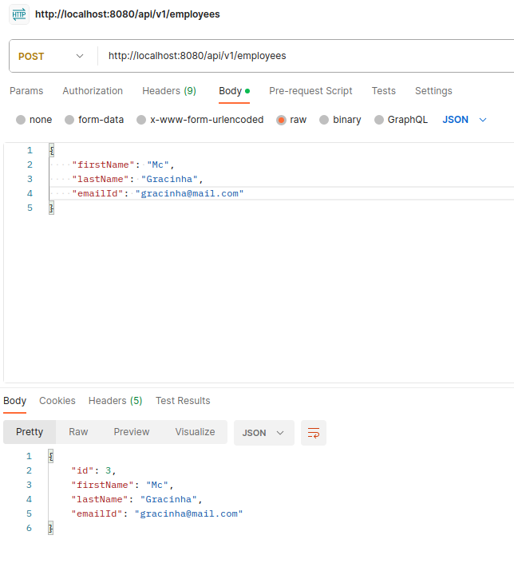
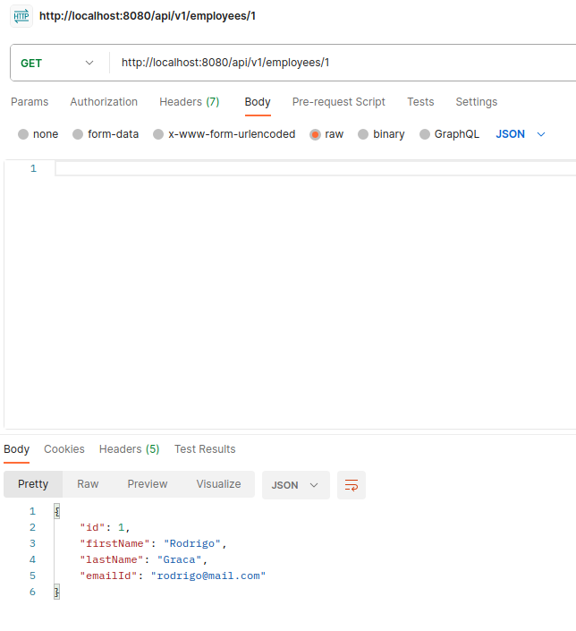
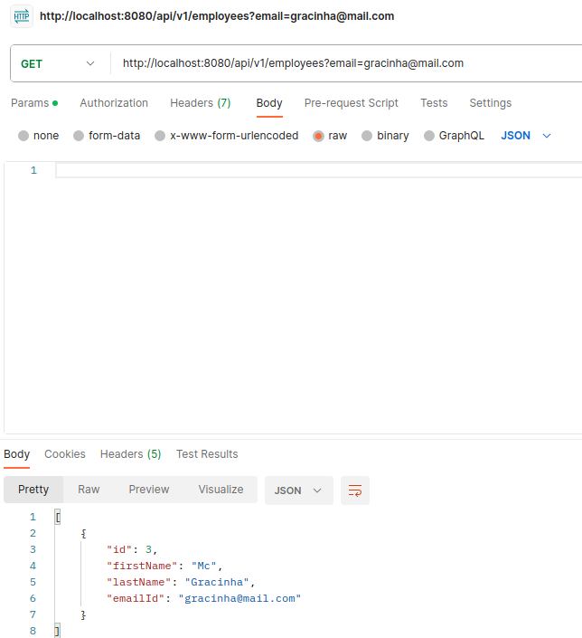
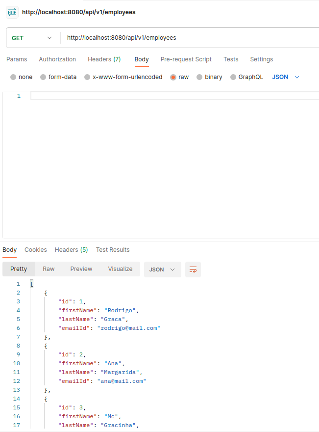
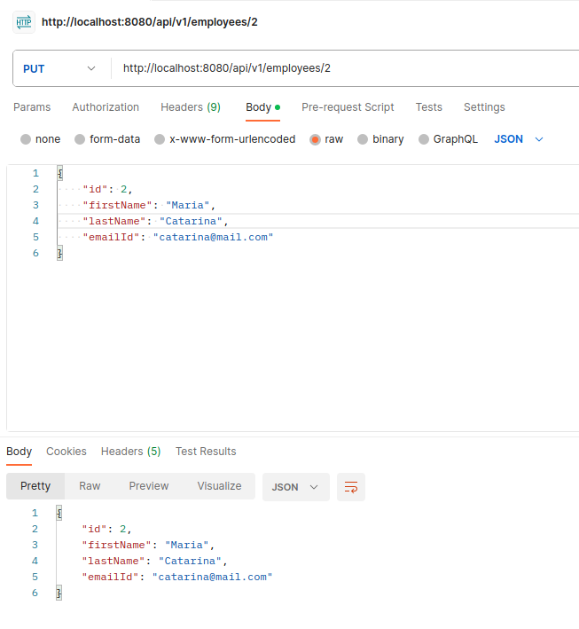
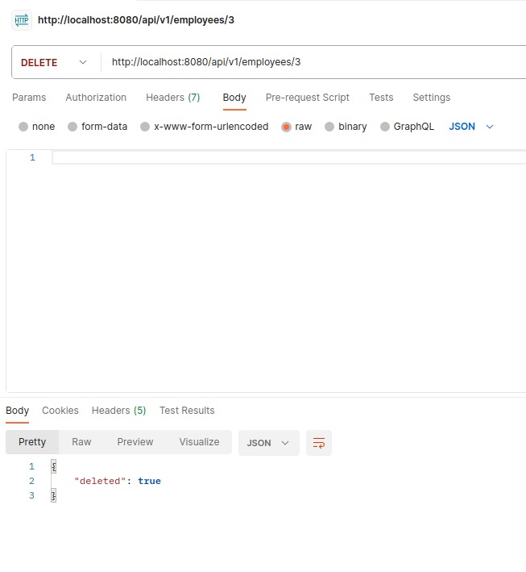

# Lab 3.2 Notes

## Docker

### Config mysql

```bash
docker run --name mysql5 -e MYSQL_ROOT_PASSWORD=secret1 -e MYSQL_DATABASE=demo -e MYSQL_USER=demo -e MYSQL_PASSWORD=secret2 -p 33060:3306 -d mysql/mysql-server:5.7
```

### Connect to mysql

```bash
docker exec -it mysql5 mysql -u root -p
```

## Test API with Postman

### Create employee

```bash
POST http://127.0.0.1:8080/api/v1/employees
```



### Create employee 2

```bash
POST http://127.0.0.1:8080/api/v1/employees
```



### Get employee by id

```bash
GET http://127.0.0.1:8080/api/v1/employees/1
```



### Get employee by email

```bash
GET http://127.0.0.1:8080/api/v1/employees?email=
```



### Get all employees

```bash
GET http://127.0.0.1:8080/api/v1/employees
```




### Update employee

```bash
PUT http://127.0.0.1:8080/api/v1/employees/2
```



### Delete employee

```bash
DELETE http://127.0.0.1:8080/api/v1/employees/3
```




Podemos realizar as demais operações mapeadas no controlador (atualização e exclusão de funcionários).

Dito isso, o POSTMAN é muito útil para testar nossa API REST.